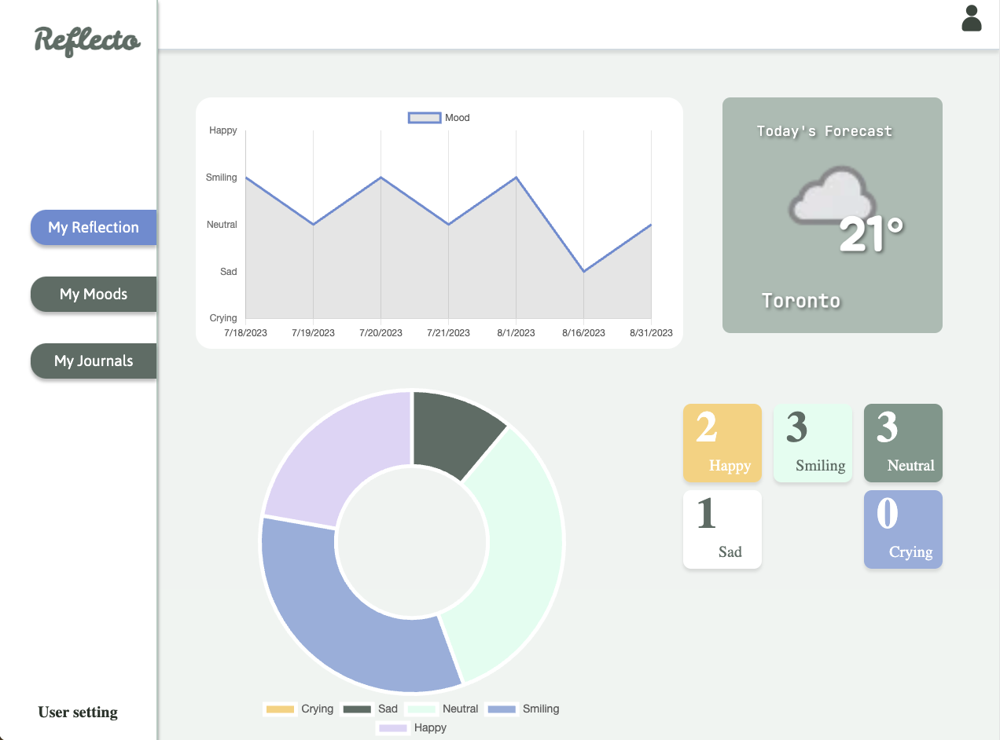
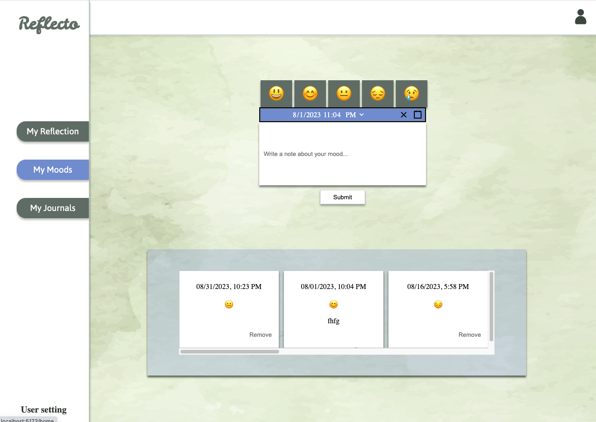
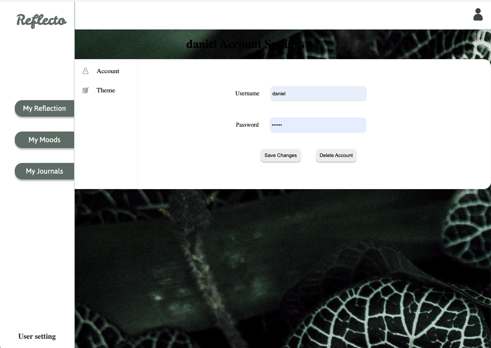
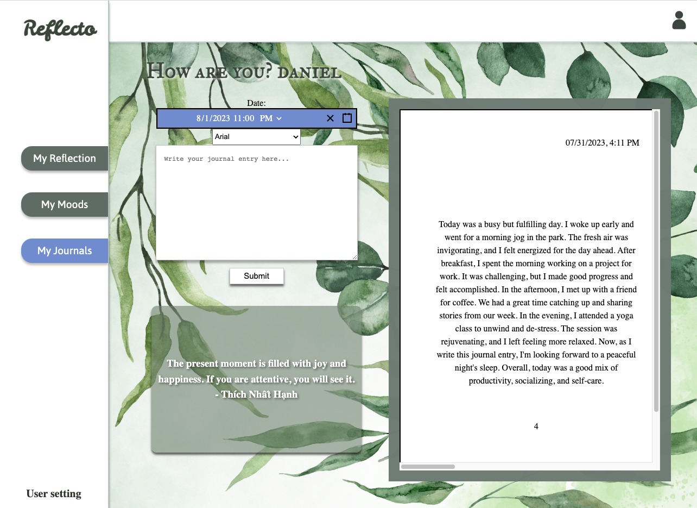

# Reflecto - Mood Journaling App

Reflecto is a user-friendly Mood Journaling app designed to empower users to track, analyze, and reflect on their emotions and mental well-being. With Reflecto, users can log their daily moods, write journal entries, and gain insights into their emotional patterns over time. The app aims to provide a safe space for self-reflection and personal growth.

  
   
   
   

## 🌟 Key Features

### MVP

- 🌟 **Mood Tracking**: Record daily moods using a range of emotions or emojis to express how you feel.
- 📖 **Journal Entries**: Write private journal entries to explore thoughts, experiences, and reflections.
- 📅 **Date Selection**: Choose the date for mood and journal entries, enabling users to update past entries.
- 📊 **Mood Trends**: Visualize mood patterns over time through interactive graphs and charts.

### Stretch Goals

- ⏰ **Reminders and Notifications**: Set personalized reminders to log entries and encourage regular reflection.
- 🔒 **Privacy and Security**: Safeguard user data with secure authentication and privacy settings.
- 📈 **Mood Analysis**: Gain insights into emotional trends and receive suggestions for emotional well-being.
- 🎨 **Customization**: Personalize Reflecto with themes, colors, and fonts to match your style.
- 📦 **Export and Backup**: Export mood journal data and create backups for peace of mind.

## 🛠️ Tech Stack

- **Front-end**: Built with React Native for a seamless and cross-platform user interface.
- **Back-end**: Node.js for server-side development and handling user data.
- **Database**: MongoDB to store and manage user mood journal entries securely.
- **Authentication**: JSON Web Tokens (JWT) for secure user authentication.
- **Data Visualization**: Used Chart.js to create interactive and visually appealing mood trend graphs.
- **Deployment**: 

## 🚀 Additional Ideas

- 🏠 **Home Screen Widgets**: Create widgets for quick mood tracking directly from the device's home screen.
- 🌐 **Social Sharing**: Allow users to share their mood journal entries with friends or support groups if desired.
- 🙏 **Gratitude Journaling**: Include an optional feature for users to record things they are grateful for each day.

##  Get Started

1. Clone this repository.

We hope Reflecto helps you cultivate self-awareness and emotional well-being. Happy mood journaling and reflection!
